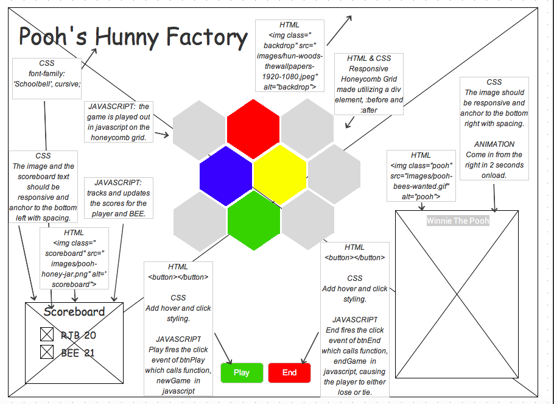

# Simon Project 

## Overview
---
> Create a game with a similar game logic to "Simon".

> Simon Game Logic: Simon has four buttons. Each button has it's own color and unique note or sound when played. To begin a game, Simon randomly lights up one button which plays it's associated sound. The player must match by pressing the button indicated by Simon. If the player fails to match Simon dims his lights, plays a "losing song" using the 4 associated notes, returns the score and the game ends. If the player successfully matches Simon his lights light up along with a "winning song" , the score is incremented and returned, and the game continues adding an additional sequence with each iteration up to the maximum attempts set my the difficulty level. The problem is you can only tie at best or lose.

> My Game Logic: A player will set up an account and choose an avatar (player-fml,score,max,dte). Each iteration of both Simon and Player are recorded temporarily in individual sequence arrays. The display will consist of the game console,scoreboard, start and stop buttons, difficulty levels of easy, medium, and hard.

* Easy Level: You have to match sequences with Simon up to 10.

* Medium Level: You have to match sequences with Simon up to 20.

* Hard Level: You have to match sequences with Simon up to 30.

## Technologies Used
---
* Languages - HTML5, CSS3, JavaScript ES6
* Design - JustInMind, Google Fonts, SoundJay, Convertio, Favic-o-Matic
* Project Planning & User Stories - GitHub Projects

# Features
---
* Honeycomb Grid, hexagon shaped divs laid out in a honeycomb pattern
* Sound and lights on the hexagons
* Scoreboard with avatars and current score
* Play and End buttons
* Menu to choose difficulty level, defaults to easy

## Wireframe
---

## Screenshot
---

## Deployed App Links
---
[Hunny Factory](https://hunny-factory.netlify.com/#redhex)

## Project Board
---
[Github Project Board](https://github.com/rosemariburton/project-1/projects/1)

## Future Development
---
### Musical Simon
Use Tone.js, a framework for creating interactive music in the browser . https://tonejs.github.io/

- [ ] Mary Had A Little Lamb
- [ ] Twinkle Twinkle Little Start
- [ ] Row Row Row Your Boat
- [ ] .Itsy Bitsy Spider

### Shuffle Simon
- Use flex order to shuffle the hexagon divs around after Simon has a turn.
---
---
## Helpful Resources
---
* [MDN Javascript Docs](https://developer.mozilla.org/en-US/docs/Web/JavaScript)
* [CSS Tricks](https://css-tricks.com)
* [W3 Schools](https://www.w3schools.com)
